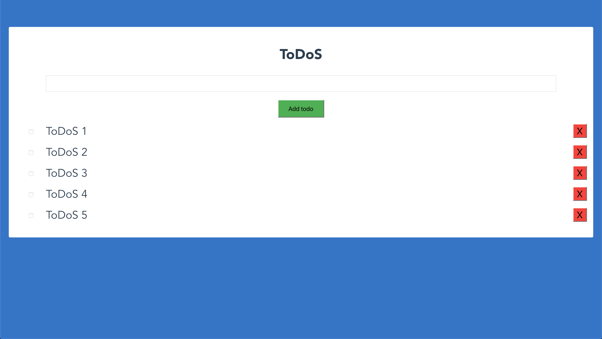

# ToDoS

Simple example of a dockerized Node/Vue/Mongo app. 

It is an application where we are going to visualize a form which allow us to create tasks list, similar to the Exercise-3, but a bit more interactive (possibility to create and cancel tasks). You can see here below an screenshot as example:



## Quick Start

Start the application

```bash
# Running the application in Docker
docker-compose up
```

## How to access API from other PCs

The external IP is required for the website to access the API from other PCs. For that, I included a shell script that automatically gets your IP Address on Linux, or lets you add a custom one if you are on Windows.

```bash
# Building the application using the external IP as an Argument
./build-docker.sh

# Running the application in Docker
docker-compose up
```
