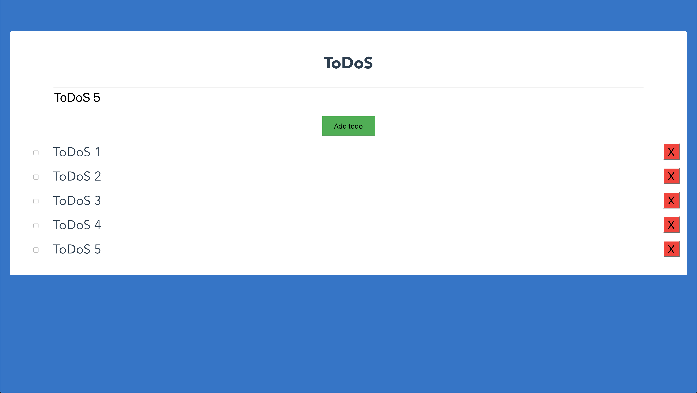

# ToDoS

Simple example of a dockerized Node/Vue/Mongo app. 

It is an application where we are going to visualize a form which allow us to create tasks list, similar to the Exercise-3, but a bit more interactive (possibility to create and cancel tasks). You can see here below an screenshot as example:



## Quick Start

Start the application

```bash
# Running the application in Docker
docker-compose up
```
