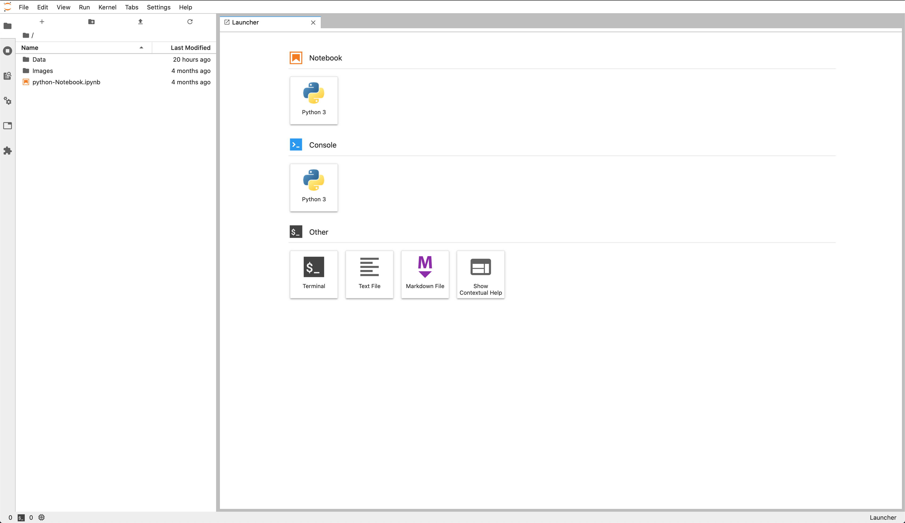

# DockerJup-Lab: Jupiter-lab on Docker 

With this exercise I will show you how to deploy Jupiter-lab on Docker. Already ready-to-run Docker images containing Jupiter applications and interactive computing tools exist as you an see in the [Jupiter-docker-stack GitHub repository](https://github.com/jupyter/docker-stacks) (created and maintained by the official Jupiter team).

**However what if we are not satisfied with these images ready-to-run and we what to have one tailored to our needs?**

After log-in to your personal space:

    

You will able to access your Jupiter-lab working space:

    

Have fun!! :)